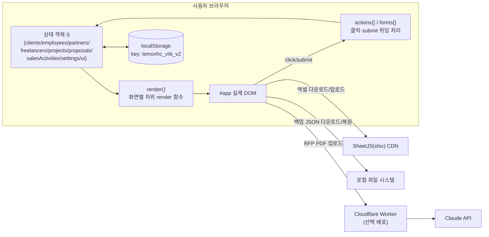
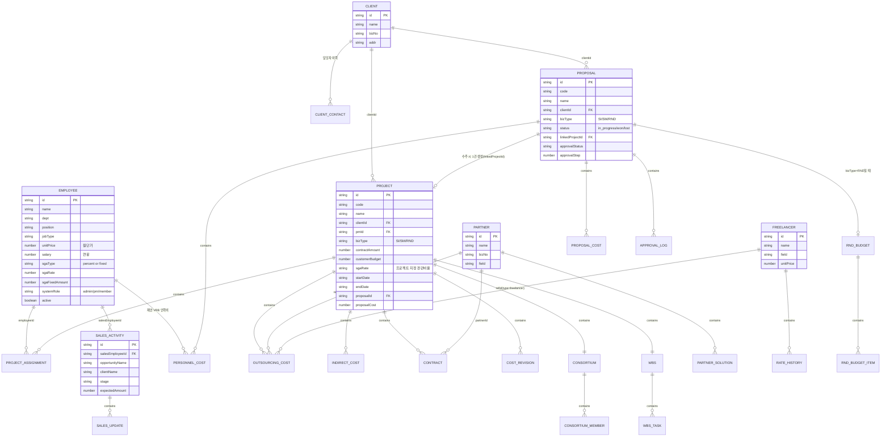
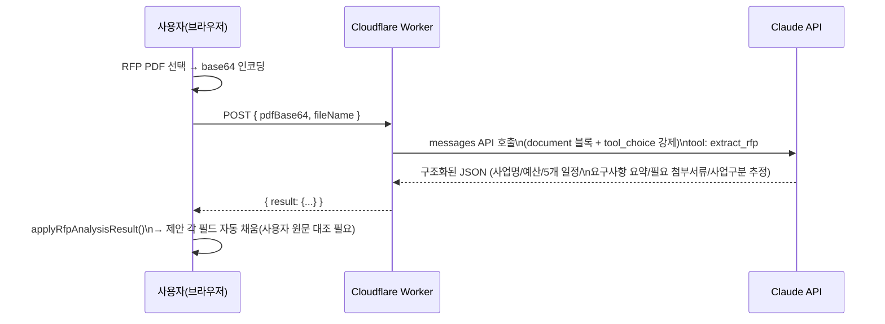

# 레몬헬스케어 공공사업 관리(VRB) — 설계서 · 기획서

> 본 문서는 현재까지 구현·배포된 소스코드를 기준으로 역산(reverse) 정리한 통합 설계 문서입니다. 개발 순서가 아니라 완성된 시스템 구조를 기준으로 서술합니다.

**문서 버전** v1.0 (2026-08-04 기준 소스코드 반영, 최신 커밋 `4ce2d8d`)
**시스템 명** 레몬헬스케어 공공사업 관리 (내부 코드명 VRB)
**소스 저장소** https://github.com/Kimhongshik/vrb
**운영 사이트** https://kimhongshik.github.io/vrb/
**소스 파일** `index.html` 단일 파일 (약 3,800줄, 순수 HTML/CSS/JavaScript)

---

## 목차

1. [기획 배경 및 목적](#1-기획-배경-및-목적)
2. [시스템 개요 및 아키텍처](#2-시스템-개요-및-아키텍처)
3. [메뉴 구성도 (사이트맵)](#3-메뉴-구성도-사이트맵)
4. [기능 요건 정의서](#4-기능-요건-정의서)
5. [사용자 권한 체계 (RBAC)](#5-사용자-권한-체계-rbac)
6. [데이터 모델 (ERD)](#6-데이터-모델-erd)
7. [핵심 업무 로직 정의](#7-핵심-업무-로직-정의)
8. [외부 연동 상세](#8-외부-연동-상세)
9. [비기능 요건](#9-비기능-요건)
10. [배포 및 운영](#10-배포-및-운영)
11. [향후 개선 과제 (Backlog)](#11-향후-개선-과제-backlog)
12. [부록: 용어집](#12-부록-용어집)

---

## 1. 기획 배경 및 목적

레몬헬스케어 공공사업본부는 공공기관 대상 SI(시스템 구축)·SM(유지보수)·연구과제(R&D) 사업을 수행하는 조직으로, 다음 업무가 하나의 흐름으로 이어집니다.

**영업 리드 발굴 → 사전영업/RFP 검토 → 제안 작성·결재 → 수주 → 프로젝트 원가/인력 관리 → 손익 정산**

이 흐름이 스프레드시트·문서 여러 개에 흩어져 있으면 (1) 제안 시점에 산정한 인건비·판관비 가정이 수주 후 프로젝트 원가와 따로 놀고, (2) 인력 한 명이 여러 프로젝트에 몇 %씩 투입되는지 실시간으로 파악하기 어렵고, (3) 컨소시엄 지분·연구과제 매칭비율처럼 계산 규칙이 복잡한 항목은 사람마다 계산식이 달라지는 문제가 있습니다. 본 시스템은 이 전체 사이클을 **하나의 데이터 모델**로 연결해, 제안 단계에서 입력한 사업 구분(SI/SM/R&D)·예산·인력비 가정이 수주 시 프로젝트로 그대로 이어지고, 프로젝트 원가는 실제 등록된 인력 투입률·판관비율·외주비·간접비로부터 항상 자동 계산되도록 하는 것을 목표로 합니다.

**핵심 설계 원칙**
- 별도 서버/DB 구축 없이 **브라우저에서 바로 쓸 수 있는 단일 HTML 파일**로 배포한다 (사내 IT 인프라 요청 없이 담당자가 즉시 도입·수정 가능).
- 화면에 보이는 숫자는 전부 **원본 입력값으로부터 자동 계산**되며, 사람이 손으로 더하는 합계 셀을 최소화한다.
- 기존 업무 산출물(월간 WBS 보고서 양식, 인력투입계획서, 계약 현황 등)을 **엑셀로 그대로 내려받아 제출**할 수 있어야 한다.
- 민감정보(연봉·단가·판관비)는 역할에 따라 **화면 단위가 아니라 항목 단위로 마스킹**한다.

**대상 사용자**
| 구분 | 설명 |
|---|---|
| 전체 관리자 (admin) | 공공사업본부장급. 전 메뉴·전 항목 열람/수정, 권한·정책 설정 |
| PM (pm) | 프로젝트/제안 실무 책임자. 담당 프로젝트 입력·원가 확인 |
| 일반 구성원 (member) | 투입 인력. 본인 프로필(기술스택·이력서·희망연봉)만 셀프 수정 |

---

## 2. 시스템 개요 및 아키텍처

### 2.1 아키텍처 특징

서버·데이터베이스가 없는 **클라이언트 전용 SPA**입니다. 하나의 `index.html`이 마크업·스타일·스크립트를 모두 포함하며, 즉시실행함수(IIFE) 안에서 상태 객체 `S`를 렌더 함수가 매번 문자열로 조립해 `#app` 요소에 그려 넣는 구조(state → render 단방향 흐름)입니다.



### 2.2 계층 구조

| 계층 | 구현 방식 |
|---|---|
| 표시(View) | 문자열 템플릿을 조립하는 `render*()` 함수군 (예: `renderDashboard`, `renderProjects`, `renderProposalDetail`) — 매 상태 변경 시 `#app.innerHTML`을 전체 재작성 |
| 상태(State) | 단일 전역 객체 `S`. 화면 간 이동/필터 상태까지 `S.ui`에 포함되어 새로고침해도 유지됨 |
| 동작(Controller) | `actions{}`(클릭), `forms{}`(폼 submit) 딕셔너리를 `data-action` / `data-form` 속성으로 매칭해 이벤트 위임 처리 |
| 저장(Persistence) | `save()` → `localStorage.setItem('lemonhc_vrb_v2', JSON.stringify(S))`. 서버 저장소 없음 |
| 마이그레이션 | `migrate()` — 이전 버전에서 저장된 데이터를 불러올 때 새로 추가된 필드를 기본값으로 채워 넣는 하위호환 계층 |

### 2.3 기술 스택

- 순수 JavaScript(ES5 스타일), 프레임워크 없음
- CSS 커스텀 프로퍼티 기반 4종 디자인 테마 (블랙/레드/화이트/네이비)
- 외부 라이브러리: **SheetJS(xlsx)** — 엑셀 다운로드/업로드 전용, CDN 스크립트 태그로 로드
- 선택적 백엔드: **Cloudflare Worker** (RFP PDF → Claude API 구조화 추출), 앱 동작에 필수는 아님

---

## 3. 메뉴 구성도 (사이트맵)

최상위 메뉴 9개(`NAV_ORDER`)는 상단 네비게이션에 고정 노출되며, 프로젝트·제안 상세 화면은 각각 입력/출력 두 축의 하위 탭 구조를 가집니다.

```mermaid
flowchart TD
  ROOT["상단 메뉴"]
  ROOT --> DASH["통계 대시보드"]
  ROOT --> PROP["제안 관리"]
  ROOT --> PROJ["프로젝트 관리"]
  ROOT --> SALES["영업 관리"]
  ROOT --> EMP["인력 관리"]
  ROOT --> PTN["협력업체 관리"]
  ROOT --> FRL["프리랜서 관리"]
  ROOT --> CLI["고객사 관리"]
  ROOT --> ADMIN["전체 관리"]
  ROOT -.역할전환시.-> ME["내 프로필"]

  DASH --> D1["기간별 원가·매출 개요\n(전체기간/당해년도/진행중)"]
  DASH --> D2["전사 손익 요약"]
  DASH --> D3["월별 매출·수주 현황"]
  DASH --> D4["수주잔고(매출잔고)"]
  DASH --> D5["프로젝트별 손익"]
  DASH --> D6["월별 인력투입 현황·가동률"]

  PROP --> PL["제안 목록 / 신규 등록"]
  PL --> PD["제안 상세"]
  PD --> PD1["RFP 업로드·AI 자동분석"]
  PD --> PD2["연구과제 예산계획\n(RND 유형에만 노출)"]
  PD --> PD3["수행 일정·첨부파일"]
  PD --> PD4["사전영업 보고서"]
  PD --> PD5["최종 제안서 첨부"]
  PD --> PD6["제안 VRB - 제안 인력비"]
  PD --> PD7["제안 VRB - 기타 비용"]
  PD --> PD8["결재선/결재 진행"]
  PD -. 수주 처리 .-> PROJ

  PROJ --> JL["프로젝트 목록 / 신규 등록"]
  JL --> JD["프로젝트 상세"]
  JD --> JIN["입력"]
  JD --> JOUT["출력(읽기전용)"]
  JIN --> JI1["기본정보"]
  JIN --> JI2["인력투입"]
  JIN --> JI3["외주비용"]
  JIN --> JI4["간접비"]
  JIN --> JI5["계약관리"]
  JIN --> JI6["WBS/진행현황"]
  JOUT --> JO1["원가요약"]
  JOUT --> JO2["인력투입 현황"]
  JOUT --> JO3["외주 내역"]
  JOUT --> JO4["간접비 내역"]
  JOUT --> JO5["원가 변경이력"]

  SALES --> S1["영업 현황 등록"]
  SALES --> S2["영업 파이프라인\n(고객사/담당/단계 필터)"]

  EMP --> E1["인력 등록/수정"]
  EMP --> E2["인력 목록\n(엑셀 다운로드/업로드)"]

  PTN --> P1["협력업체 등록/수정"]
  PTN --> P2["협력업체 목록·누적매출·계약리스트\n(엑셀 다운로드/업로드)"]

  FRL --> F1["프리랜서 등록/수정"]
  FRL --> F2["프리랜서 목록·누적매출\n(엑셀 다운로드/업로드)"]

  CLI --> C1["고객사 등록/수정"]
  CLI --> C2["고객사 목록·담당자 이력\n(엑셀 다운로드/업로드)"]

  ADMIN --> A1["권한 관리"]
  ADMIN --> A2["전사 기본 판관비율"]
  ADMIN --> A3["프로젝트별 판관비율 설정"]
  ADMIN --> A4["로고·사이트 이름 설정"]
  ADMIN --> A5["사이트 디자인 테마"]
  ADMIN --> A6["RFP 자동분석 연동 설정"]
  ADMIN --> A7["데이터 백업/복원"]
```



---

## 4. 기능 요건 정의서

### 4.1 통계 대시보드

| ID | 기능명 | 설명 |
|---|---|---|
| DASH-01 | 기간별 원가·매출 개요 | 전체기간 / 당해년도(진행기준) / 진행중 프로젝트 3개 축으로 원가 구성·총매출·총원가 요약 |
| DASH-02 | 전사 손익 요약 | 매출·원가·이익·이익률을 기간 선택(누적/롤링) 기준으로 표시 |
| DASH-03 | 월별 매출·수주 현황 | 월별 매출/수주 막대그래프 + 기간 지정 |
| DASH-04 | 수주잔고(매출잔고) | 계약은 됐지만 진행기준 매출로 아직 인식 안 된 잔여분을 월별 추이로 표시 |
| DASH-05 | 프로젝트별 손익 | 전체기간 기준 프로젝트별 계약금액·원가·손익 리스트 |
| DASH-06 | 월별 인력투입 현황 | 전체/투입/비가동 인원수, 가동률을 월별로 표시. 비가동 인력 명단 드릴다운 |

### 4.2 제안 관리

| ID | 기능명 | 설명 |
|---|---|---|
| PROP-01 | 제안 등록 | 사업 공고 인지 시점부터 제안 건 등록. 사업구분(SI/SM/RND)을 이 단계에서 지정 → 수주 시 프로젝트로 그대로 전달 |
| PROP-02 | RFP 자동분석 | RFP PDF 업로드 → Claude API가 사업명·예산·5개 일정·요구사항 요약·필요 첨부서류·사업구분 추정을 자동 채움 (§8.1) |
| PROP-03 | 연구과제(RND) 예산계획 | 사업구분이 RND인 제안에만 노출. 정부출연금/민간부담금(현금·현물) 매칭비율 자동 산정, 비목별 편성, 인력 일괄등록(4대보험 포함), 엑셀 다운로드/업로드 |
| PROP-04 | 수행 일정 관리 | 사전공고~결과발표 5개 마일스톤 날짜+첨부파일(사전공고/공고는 다중 첨부 가능) |
| PROP-05 | 사전영업 보고서 | 개요·예상예산·경쟁사·전략·리스크 작성 후 결재 요청, Word 파일 다운로드 |
| PROP-06 | 최종 제안서 첨부 | 정성/정량제안서·발표자료 등 카테고리별 파일 첨부 |
| PROP-07 | 제안 VRB - 인력비 | 사내 인력 선택 + 제안기간(일) 입력 → 연봉 일할 계산 + 판관비(%) 가산으로 자동 산출 |
| PROP-08 | 제안 VRB - 기타비용 | 외주디자인비·인쇄비·출장비 등 인력비 외 비용 등록 |
| PROP-09 | 결재 프로세스 | 순차 결재선 지정 → 상신 → 각 결재자 승인 시 다음 결재자로 자동 이관 → 전원 승인 시 승인 완료, 반려 시 처음부터 재상신 |
| PROP-10 | 수주/실주 처리 | 수주 처리 시 프로젝트 자동 생성(사업구분·고객사·PM후보·제안비용 합계 승계), 실주 처리 시 상태만 변경 |

### 4.3 프로젝트 관리

| ID | 기능명 | 설명 |
|---|---|---|
| PROJ-01 | 기본정보 | 계약금액·고객예산·판관비율·시작/종료일. 상태(예정/진행중/완료)는 날짜 기준 자동 전환 |
| PROJ-02 | 컨소시엄 관리 | 참여사(협력업체 또는 자사) + 지분율 등록. 매출 인식은 자사 지분율만 반영 |
| PROJ-03 | 인력투입 | 인력·역할 선택 + 투입비율(%) → 원가 자동계산. 엑셀 다운로드/업로드(전체교체) |
| PROJ-04 | 외주비용 | 협력업체(보유 솔루션 선택 또는 일반 용역비) / 프리랜서(월비용×개월수) 비용 입력 |
| PROJ-05 | 간접비 | 임대료·렌탈비 등 카테고리별 항목 입력, 카테고리 선택 시 참고단가 자동 채움 |
| PROJ-06 | 계약관리 | 협력업체별 계약명·기간·금액·내용 + 계약서/견적서/기타파일 첨부. 엑셀 다운로드(계약금액 합계 수식 포함) |
| PROJ-07 | WBS/진행현황 | Domain·Activity·Task 단위 일정·가중치 등록, 기준일 대비 계획/실적 진도율 자동 계산·롤업. 엑셀 다운로드(계획완료율 실시간 수식)/업로드(전체교체) |
| PROJ-08 | 원가요약(출력) | 인력비·판관비·외주비·간접비·제안비용 자동 집계 |
| PROJ-09 | 인력투입 현황(출력) | 월별 인력×역할×인건비 매트릭스 |
| PROJ-10 | 원가 변경이력 | 원가 산정 근거 변경 시 사유를 시계열 스냅샷으로 기록 |

### 4.4 영업 관리

| ID | 기능명 | 설명 |
|---|---|---|
| SALES-01 | 영업현황 등록 | 잠재 사업(리드~수주/실주) 단계·예상금액·예상일자 등록. 등록된 고객사만 선택 가능 |
| SALES-02 | 영업 파이프라인 | 목록 + 고객사/영업담당/단계 필터, 건별 업데이트 이력 추가 |

### 4.5 인력 / 협력업체 / 프리랜서 / 고객사 관리 (마스터 데이터)

| ID | 기능명 | 설명 |
|---|---|---|
| MST-01 | 인력 등록/수정 | 부서·직급·직무·단가·연봉·판관비 방식·시스템 권한 등. 직무가 영업/기획/영업지원이면 상시비가동 자동 체크 |
| MST-02 | 협력업체 등록/수정 | 영업담당/PM담당 연락처, 보유 솔루션(카테고리별) 등록 |
| MST-03 | 프리랜서 등록/수정 | 단가 변경 시 변경이력(rateHistory) 자동 적재 |
| MST-04 | 고객사 등록/수정 | 담당자 복수 등록 및 재직기간 이력 관리 |
| MST-05 | 마스터 목록 화면 | 각 목록에서 클릭 시 상세 이력(담당자/참여 프로젝트/누적매출/계약리스트) 드릴다운 |
| MST-06 | 엑셀 일괄 등록/갱신 | 인력·협력업체·프리랜서·고객사 4종 모두 이름 매칭 기반 추가/갱신(UPSERT) 지원 |

### 4.6 전체 관리 (Admin)

| ID | 기능명 | 설명 |
|---|---|---|
| ADM-01 | 권한 관리 | 권한명 클릭 시 해당 권한 보유 인력 목록 표시, 그 자리에서 권한 조정 |
| ADM-02 | 전사 기본 판관비율 | 개인별 판관비율 미입력 시 적용되는 기본값 |
| ADM-03 | 프로젝트별 판관비율 | 지정 시 참여 인력 개인 설정보다 우선 적용 |
| ADM-04 | 로고·사이트 이름 설정 | 이미지 업로드(브라우저 저장) 및 사이트명 직접 입력 |
| ADM-05 | 디자인 테마 | 블랙/레드/화이트/네이비 4종 중 선택, 즉시 전체 배색 전환 |
| ADM-06 | RFP 자동분석 연동 설정 | Cloudflare Worker 엔드포인트 URL 등록 |
| ADM-07 | 데이터 백업/복원 | 전체 데이터 JSON 다운로드 / 백업파일로부터 복원(덮어쓰기 확인) |

### 4.7 내 프로필 (셀프서비스)

| ID | 기능명 | 설명 |
|---|---|---|
| ME-01 | 사용자 전환(페르소나) | 상단 셀렉트에서 시연할 인력 계정으로 전환 — 실제 로그인이 아니라 화면 시연/권한 확인용 |
| ME-02 | 셀프 수정 | 기술스택·이력서·희망연봉을 본인이 직접 수정 |

### 4.8 엑셀 대량 입출력 (범-메뉴 공통 기능)

| 대상 | 다운로드 | 업로드 | 반영 방식 | 수식/합계 |
|---|---|---|---|---|
| WBS 작업 | ✅ | ✅ | 전체교체(확인 필요) | 계획완료율 실시간 수식, 가중치 합계 |
| 인력(직원) | ✅ | ✅ | 이름기준 추가/갱신 | 연봉÷12 참고, 판관비포함월단가 자동계산, 연봉·월단가 합계 |
| 인력투입(프로젝트별) | ✅ | ✅ | 전체교체(확인 필요) | 참여율 합계 |
| 연구과제 예산편성 | ✅ | ✅ | 전체교체(확인 필요) | 재원구분별 소계 + 총계(SUMIF) |
| 협력업체 | ✅ | ✅ | 이름기준 추가/갱신 | — |
| 프리랜서 | ✅ | ✅ | 이름기준 추가/갱신 | — |
| 계약(프로젝트별) | ✅ | ❌(내보내기 전용) | — | 계약금액 합계 |
| 고객사 | ✅ | ✅ | 이름기준 추가/갱신 | — |

---

## 5. 사용자 권한 체계 (RBAC)

계정 가입 화면은 없습니다. 관리자가 **인력 관리 화면에서 계정을 등록**하면서 시스템 권한(`systemRole`)을 함께 부여합니다.

| 권한 | 값 | 열람 가능 범위 |
|---|---|---|
| 전체 관리자 | `admin` | 전 메뉴 + 전 인력의 연봉/단가/판관비 등 민감정보 |
| PM | `pm` | 일반 화면 전체 (현재 구현상 민감정보 마스킹은 admin 여부로만 판정, pm은 member와 동일하게 마스킹됨) |
| 일반 구성원 | `member` | 본인 급여/단가만 열람 가능, 타인 정보는 "비공개" 마스킹. "전체 관리" 메뉴 자체가 비노출 |

**판정 로직**
- `currentViewerRole()` — 상단 "사용자 전환" 셀렉트에서 특정 인력을 선택하지 않은 기본 상태는 항상 `admin`으로 간주(관리자 시점). 특정 인력으로 전환하면 그 인력의 `systemRole`을 따름.
- `isViewerAdmin()` — `전체 관리` 메뉴, 인력관리 화면의 엑셀 버튼 등은 이 값이 `true`일 때만 노출.
- `canViewSalaryOf(empId)` — admin이거나, 전환된 본인(`personaEmployeeId===empId`)일 때만 `true`.
- `maskedMoney(canView, amount)` — `false`이면 금액 대신 `"비공개"` 문자열을 렌더링. 연봉·월단가·판관비 등 급여성 항목 전반에 적용.

> ⚠️ 현재 구현은 "로그인"이 아니라 **화면 상단에서 인력을 선택해 그 인력의 시점으로 전환**하는 방식입니다(데모/시연 목적). 실제 인증(비밀번호 등)은 없으므로 사내 배포 시 별도 접근 통제(사내망 한정 등)가 필요합니다 — §9, §11 참고.

---

## 6. 데이터 모델 (ERD)

전체 데이터는 브라우저 `localStorage`에 **하나의 JSON 객체**(`STORE_KEY = 'lemonhc_vrb_v2'`)로 저장됩니다. 관계형 DB가 아니므로 아래 ERD는 실제 테이블이 아니라 **문서 내 중첩 구조를 엔티티로 풀어낸 논리 모델**입니다 — 화살표가 있는 것은 ID 참조(예: `clientId`), 화살표가 없고 박스가 붙어있는 것은 부모 문서 안에 배열/객체로 내장된 하위 구조입니다.



### 6.1 엔티티별 필드 상세

#### CLIENT (고객사) — `S.clients[]`
| 필드 | 타입 | 설명 |
|---|---|---|
| id | string | `cli_*` |
| name | string | 고객사명 |
| bizNo | string | 사업자번호 |
| addr | string | 주소 |
| contacts[] | array | ▸ CLIENT_CONTACT: `id, field(담당분야), name, phone, email, startDate, endDate` |

#### EMPLOYEE (내부 인력) — `S.employees[]`
| 필드 | 타입 | 설명 |
|---|---|---|
| id | string | `emp_*` |
| name, dept, position | string | 이름/부서/직급 |
| jobType | string | PM/PL/PMO/사업관리/TA/AA/DA/개발/QA/디자인/기획/영업/영업지원/기타 |
| alwaysNonBillable | boolean | 상시 비가동(영업/기획/영업지원 선택 시 자동 체크) |
| skills[] | string[] | 기술스택(다중 선택) |
| resume | object\|null | `{name, size}` — 실제 파일 바이너리는 저장하지 않고 메타정보만 |
| salary | number | 연봉 |
| unitPrice | number | 월단가(연봉과 별개로 직접 저장 — 연봉÷12로 자동 채워지되 수동 조정 가능) |
| sgaType | string | `percent`(비율) \| `fixed`(정액) |
| sgaRate | number\|'' | 개인 판관비율(%), 비우면 전사 기본값 적용 |
| sgaFixedAmount | number | 정액 판관비(원/월) |
| systemRole | string | `admin`\|`pm`\|`member` |
| email, phone, hireDate | string | 연락처/입사일 |
| active | boolean | 재직 여부 |

#### PARTNER (협력업체) — `S.partners[]`
| 필드 | 타입 | 설명 |
|---|---|---|
| id, name, bizNo, field | string | 업체명/사업자번호/전문분야 |
| salesContact / pmContact | object | 각각 `{name, phone, email}` |
| solutions[] | array | ▸ PARTNER_SOLUTION: `id, category(상용 SW 분류), products(제품명)` |

#### FREELANCER (프리랜서) — `S.freelancers[]`
| 필드 | 타입 | 설명 |
|---|---|---|
| id, name, field | string | |
| unitPrice | number | 현재 단가 |
| phone, email | string | |
| rateHistory[] | array | ▸ RATE_HISTORY: `id, date, oldRate, newRate` — 단가 변경 시 자동 적재 |

#### PROJECT (프로젝트) — `S.projects[]`
| 필드 | 타입 | 설명 |
|---|---|---|
| id, code, name | string | |
| clientId, pmId, proposalId | string(FK) | |
| bizType | string | SI/SM/RND — 연결된 제안의 값 승계 |
| contractAmount, customerBudget | number | 계약금액 / 고객예산 |
| sgaRate | string\|number | 프로젝트 지정 판관비율(우선 적용), 비우면 인력별 설정 사용 |
| startDate, endDate | string | 진행상태 자동판정 기준 |
| proposalCost | number | 수주 시 제안비용 합계 승계 |
| assignments[] | array | ▸ PROJECT_ASSIGNMENT: `id, employeeId, ratio(%), role` |
| outsourcingCosts[] | array | ▸ OUTSOURCING_COST: `id, type(partner/freelancer), refId, amount 또는 monthlyCost+months, memo, date` |
| indirectCosts[] | array | ▸ INDIRECT_COST: `id, categoryCode, categoryName, basis, quantity, unitPrice, amount, date` |
| contracts[] | array | ▸ CONTRACT: `id, partnerId, name, startDate, endDate, amount, description, files[]` |
| costRevisions[] | array | ▸ COST_REVISION: `id, date, reason, by` |
| consortium | object | `{isConsortium, role, members[{id, partnerId(null=자사), role, sharePct}]}` |
| wbs | object | `{reportDate, tasks[{id, domain, activity, name, startDate, endDate, actualRate, weight, assignee}]}` |
| milestones | object | PROPOSAL과 동일 구조(§ milestones 참고), 프로젝트 자체 일정 관리용 |

#### PROPOSAL (제안) — `S.proposals[]`
| 필드 | 타입 | 설명 |
|---|---|---|
| id, code, name, clientId | | |
| bizType | string | SI/SM/RND |
| salesEmployeeId, pmCandidateId | string(FK) | 영업담당 / 예상 PM |
| status | string | `in_progress`\|`won`\|`lost` |
| linkedProjectId | string(FK) | 수주 시 생성된 프로젝트 id |
| createdAt | string | |
| milestones | object | `preAnnounce/rfp/proposalDeadline/proposalPresentation/resultAnnounce` 각각 `{date, file 또는 files[]}` |
| presales | object | 사전영업보고서: `overview, estimatedBudget, expectedAnnounceDate, competitors, strategy, risks, authorId, authorDate` |
| approvalStatus | string | `draft`\|`submitted`\|`approved`\|`rejected` |
| approvalLine[] | string[] | 결재자 employeeId 순서 배열 |
| approvalStep | number | 현재 결재 단계 인덱스 |
| approvalLog[] | array | `{date, action, by}` 이력 |
| proposalCosts[] | array | ▸ PROPOSAL_COST(기타비용): `id, category, description, amount` |
| personnelCosts[] | array | ▸ PERSONNEL_COST(제안VRB 인력비): `id, employeeId, days, salarySnapshot, sgaPct, laborAmount, sgaAmount, amount` |
| finalDocs[] | array | `{id, category, file}` |
| rfpAnalysis | object\|null | `{requiredAttachments[], analyzedAt}` — AI 분석 결과 요약 |
| rndBudget | object | RND 유형 전용, §6.2 참고 |

#### RND_BUDGET (연구과제 예산계획) — `proposal.rndBudget`
| 필드 | 타입 | 설명 |
|---|---|---|
| orgType | string | `nonprofit`\|`sme`\|`mid`\|`large` |
| researchStage | string | `basic`\|`applied`\|`development` |
| totalBudget | number | 총 연구개발비 |
| govRatio, cashOfSelfRatio | number\|null | 미지정 시 orgType×researchStage 매트릭스에서 기본값 산출 |
| items[] | array | ▸ RND_BUDGET_ITEM: `id, category(8개 비목), fundSource(gov/cashSelf/inkindSelf), description, amount` |

#### SALES_ACTIVITY (영업 파이프라인) — `S.salesActivities[]`
| 필드 | 타입 | 설명 |
|---|---|---|
| id, salesEmployeeId | | |
| opportunityName, clientName | string | |
| stage | string | 리드/미팅/제안준비/제안중/수주/실주 |
| expectedAmount, expectedDate | number/string | |
| updates[] | array | `{id, date, note}` |

#### SETTINGS — `S.settings`
| 필드 | 설명 |
|---|---|
| defaultSgaRate | 전사 기본 판관비율(%) |
| siteTitle, siteSubtitle | 사이트명 |
| theme | `black`\|`red`\|`white`\|`navy` |
| logoDataUri | 업로드 로고(base64) |
| rfpAnalysisEndpoint | RFP 분석 Worker URL |

### 6.2 정규화 관점 메모

문서형(JSON) 저장이라 관계형 DB의 3정규형과는 다른 기준으로 봐야 하지만, 실제 RDB로 이전한다면 다음이 별도 테이블 후보입니다: `client_contacts`, `partner_solutions`, `freelancer_rate_history`, `project_assignments`, `project_outsourcing_costs`, `project_indirect_costs`, `project_contracts`, `project_cost_revisions`, `consortium_members`, `wbs_tasks`, `proposal_costs`, `proposal_personnel_costs`, `proposal_approval_log`, `rnd_budget_items`, `sales_activity_updates`. 파일 첨부는 현재 **파일명·크기 메타데이터만** 저장되고 실제 바이너리는 저장되지 않으므로(§9), RDB 전환 시 별도 오브젝트 스토리지 연동이 필요합니다.

---

## 7. 핵심 업무 로직 정의

### 7.1 프로젝트 원가 계산 — `computeProjectCost(p)`

```
labor(인건비)      = Σ 각 참여인력의 totalLabor          [computeAssignment]
overheadRate(판관비) = Σ 각 참여인력의 sga                [computeAssignment]
outsourcing(외주비)  = Σ outsourcingCosts[].amount
indirectItemized(간접비) = Σ indirectCosts[].amount
direct(직접비)      = labor + outsourcing
indirect(간접비합)   = overheadRate + indirectItemized
total(총원가)       = direct + indirect + proposalCost(제안비용)
revenue(매출)       = projectRevenue(p)  — §7.3
margin(이익)        = revenue - total
marginRate(이익률)   = margin / revenue × 100
```

### 7.2 인력 투입 원가 — `computeAssignment(a, p)`

- `months` = 프로젝트 시작~종료월 개월수
- `monthlyLabor` = 인력 월단가 × (투입비율 ÷ 100)
- `totalLabor` = monthlyLabor × months
- 판관비(sga) 산정은 **우선순위 3단계**:
  1. 프로젝트에 `sgaRate`가 지정되어 있으면 → `totalLabor × 프로젝트 판관비율`
  2. 아니고 인력의 `sgaType==='fixed'`이면 → `정액 × months` (투입비율 무관)
  3. 그 외 → `totalLabor × (개인 판관비율 또는 전사 기본값)`

### 7.3 컨소시엄 매출 인식 — `projectRevenue(p)`

컨소시엄 사업은 `contractAmount`가 **컨소시엄 전체 계약금액**이며, 실제 매출로 인식하는 금액은 `consortium.members`에서 자사(`partnerId===null`) 지분율(`sharePct`)만큼입니다: `revenue = contractAmount × (자사지분율 ÷ 100)`.

### 7.4 진행기준 손익 / 수주잔고 — `progressBasisPnl`, 대시보드 로직

- `projectProgressRatio(p, 기준일)`: 시작~종료일 사이 기준일 위치를 0~1 비율로 환산 (선형 진행률 가정)
- 특정 기간의 인식 매출/원가 = `projectRevenue(p) × (기간 종료시점 진행률 - 기간 시작시점 진행률)`
- 수주잔고 = 계약금액(자사분) − 오늘까지 누적 인식 매출

### 7.5 WBS 진도율 — `wbsPlannedRate`, `wbsRollup`

- 개별 작업(Task)의 **계획완료율** = 기준일이 시작일 이전이면 0%, 종료일 이후면 100%, 그 사이면 `(기준일-시작일)/(종료일-시작일)×100`
- 그룹(도메인) 롤업 = 가중치(weight) 가중평균으로 계획율/실적율 산출
- **공정율** = 실적율 ÷ 계획율 × 100 (계획 대비 실제 진도 비율)
- 다운로드한 엑셀의 계획완료율 셀은 정적 숫자가 아니라 **엑셀 수식**으로 기록되어, 시작일·종료일·기준일(파일 우측 상단 셀)을 수정하면 자동 재계산됩니다(§8.2).

### 7.6 연구과제(R&D) 예산 매칭비율 — `rndTargetAmounts`

기관유형(비영리/중소/중견/대기업) × 연구단계(기초/응용/개발) 12개 조합별 정부출연금·민간부담금(현금) 매칭비율표(`RND_MATCHING_RATIOS`)를 내장하고 있으며, 사용자가 직접 비율을 덮어쓸 수 있습니다. 목표금액과 실제 편성금액(비목별 합계, `rndActualTotals`)을 나란히 비교해 편성 오차를 확인합니다. 인건비 비목은 참여 인력을 선택하면 4대보험(국민연금·건강보험·고용보험·산재보험) 요율을 반영해 자동 산출합니다.

> 매칭비율·4대보험 요율은 화면에도 "일반적 참고치이며 실제 공고문 기준으로 확인 필요"라는 안내 문구가 노출됩니다(법령/고시 변경 가능성 때문).

### 7.7 결재 프로세스 — `submit-for-approval` / `approve-proposal` / `reject-proposal`

순차 결재선(`approvalLine[]`) + 현재 단계(`approvalStep`) 방식입니다. 상신 시 1번 결재자부터 대기 상태가 되고, 각 결재자가 승인할 때마다 `approvalStep`이 1씩 증가하며 마지막 결재자까지 승인되면 `approvalStatus='approved'`로 전환됩니다. 반려되면 `approvalStep`이 0으로 초기화되어 처음부터 재상신해야 합니다.

### 7.8 프로젝트 상태 자동 판정 — `projectStatus(p)`

시작일이 있으면 오늘 날짜와 시작/종료일을 비교해 `예정/진행중/완료`를 자동 판정합니다. 시작일이 없는(아직 프로젝트화되지 않은, 즉 제안 상태의) 경우 마일스톤 중 가장 최근에 채워진 날짜를 기준으로 `준비중→사전공고→입찰중→제안마감→제안발표→결과발표` 단계를 표시합니다.

---

## 8. 외부 연동 상세

### 8.1 RFP PDF AI 자동분석



- 백엔드는 필수가 아니며, 관리자가 "전체 관리 > RFP 자동분석 연동"에 Worker URL을 등록해야 활성화됩니다.
- Worker는 `ANTHROPIC_API_KEY`를 Cloudflare Secret으로만 보관하며 프론트에는 노출되지 않습니다.
- **CSP 제약**: claude.ai 아티팩트 미리보기 링크는 외부 fetch가 차단되어 이 기능이 동작하지 않습니다. 로컬 파일로 열거나 GitHub Pages 등 실제 호스팅에서만 동작합니다.

### 8.2 엑셀 대량 입출력 (SheetJS)

- 다운로드: `XLSX.utils.aoa_to_sheet` + 필요 시 특정 셀을 `{t:'n', f:수식, v:캐시값}` 형태로 직접 덮어써 **실제 엑셀 수식**을 심음 (WBS 계획완료율, 각종 합계/소계).
- 업로드: `FileReader` → `XLSX.read` → `sheet_to_json({header:1, raw:false})`로 헤더 행 제거 후 파싱. `raw:false`로 읽기 때문에 날짜 서식이 지정된 셀은 `yyyy-mm-dd` 문자열로 안전하게 되돌아옵니다.
- 반영 방식은 엔티티 성격에 따라 3가지로 나뉩니다(§4.8 표 참고):
  - **전체교체**: WBS 작업, 인력투입, RND 비목편성 — 업로드 시 확인 모달 후 기존 목록을 통째로 대체
  - **추가/갱신(UPSERT)**: 인력, 협력업체, 프리랜서, 고객사 — 이름이 같으면 갱신, 새 이름이면 신규 추가
  - **내보내기 전용**: 계약 현황 — 보고 자료 용도로만 제공
- SheetJS는 CDN에서 로드되므로 claude.ai 아티팩트 미리보기(CSP)에서는 비활성화되고 그레이스풀 디그레이드(안내 토스트)로 처리됩니다.

### 8.3 데이터 백업/복원

전체 관리 화면에서 현재 `S` 객체를 JSON 파일로 다운로드하거나, 이전 백업 파일을 업로드해 전체 상태를 덮어쓸 수 있습니다(확인 모달 필수). 서버가 없으므로 이 기능이 사실상 유일한 "이력 보존" 수단입니다.

### 8.4 디자인 테마 시스템

CSS 커스텀 프로퍼티(`--ink/--paper/--panel/--line/--muted` + 브랜드/의미색)를 `:root[data-theme="..."]`로 4세트 정의하고, 전체 관리에서 선택하면 `document.documentElement`의 `data-theme` 속성만 바꿔 즉시 전체 배색이 전환됩니다. 성공/경고/위험/정보 등 의미색은 테마와 무관하게 역할이 고정되고 톤만 미세 조정됩니다.

---

## 9. 비기능 요건

| 구분 | 내용 |
|---|---|
| 브라우저 호환성 | 최신 Chrome/Edge/Firefox 기준. `document.addEventListener`, CSS 커스텀 프로퍼티, `padStart` 등 ES2017 수준 이상을 사용하므로 구형 브라우저(레거시 IE 등)는 미지원 |
| 데이터 보존 | **브라우저 localStorage 단일 저장소** — 브라우저 데이터 삭제, 시크릿 모드, 기기 변경 시 데이터가 사라짐. §8.3 백업 기능으로 주기적 백업 필수 |
| 다중 사용자 | 동시 편집/동기화 불가 — 각 사용자의 브라우저에 독립적으로 저장되는 구조이므로, 여러 명이 함께 쓰려면 한 사람이 대표로 입력 후 백업 JSON을 공유하거나 향후 서버 저장소 도입이 필요(§11) |
| 보안/인증 | 로그인·비밀번호 없음(§5). 민감정보(연봉 등)는 화면상 마스킹되지만 브라우저 개발자도구로 localStorage 원본에 접근하면 그대로 노출됨 — **사내망 한정 배포를 전제**로 설계됨 |
| 파일 첨부 | 실제 바이너리 미저장, 파일명·크기 메타데이터만 기록(§6.2) — 재현/미리보기 불가 |
| 성능 | 상태 변경마다 `#app.innerHTML` 전체를 재작성하는 방식이라 데이터량이 매우 커지면(수백~수천 건) 렌더링 지연 가능성 있음. 현재 시드 데이터 규모(수십 건)에서는 문제 없음 |
| 국제화 | 한국어 고정, 다국어 미지원 |
| 테스트 | 로컬에 Node.js가 없는 환경 특성상, mshta.exe 기반 오프라인 HTA 테스트 하네스로 회귀 테스트를 수행(§10.3) |

---

## 10. 배포 및 운영

### 10.1 배포 구조

| 구분 | 위치 |
|---|---|
| 소스 저장소(정본) | `github.com/Kimhongshik/vrb` (public) — `index.html` + `backend/rfp-analyzer-worker.js` |
| 운영 사이트 | GitHub Pages, `https://kimhongshik.github.io/vrb/` — 실제 fetch/외부연동이 동작하는 유일한 배포처 |
| 미리보기 링크 | claude.ai 아티팩트 — 빠른 확인용, CSP로 외부 API·CDN 호출 차단(§8.1, §8.2) |
| RFP 분석 백엔드(선택) | Cloudflare Workers — 별도 배포 필요, `ANTHROPIC_API_KEY` 시크릿 등록 필요 |

### 10.2 저장소 구조

```
vrb/
├── index.html                      # 애플리케이션 전체(단일 파일)
└── backend/
    └── rfp-analyzer-worker.js      # RFP 분석용 Cloudflare Worker (선택 배포)
```

### 10.3 품질 검증 방식

Node.js가 없는 로컬 환경 특성상, `mshta.exe`(Windows 내장) 기반 오프라인 HTA 하네스를 즉석에서 구성해 앱의 `<script>` 본문을 추출·실행하고 주요 액션/렌더 함수를 단정문으로 검증한 뒤 배포합니다. SheetJS가 필요한 엑셀 기능은 모의(mock) XLSX 객체로 수식·셀 참조까지 검증합니다.

---

## 11. 향후 개선 과제 (Backlog)

| 우선순위 | 항목 | 비고 |
|---|---|---|
| 높음 | 산출물(성과물) 작성현황 트래커 | 업로드했던 실제 월간 WBS 보고서 양식의 산출물 관리 섹션은 WBS 기능 구현 시 범위에서 제외됨. 현재 미구현 |
| 높음 | 서버/DB 도입 검토 | 다중 사용자 동시 편집, 데이터 유실 방지, 실제 파일 바이너리 저장을 위해 필요 |
| 중간 | 실 로그인/인증 | 현재는 페르소나 전환 방식(비밀번호 없음) — 사내 배포 확대 시 SSO/비밀번호 인증 필요 |
| 중간 | pm 권한의 실질적 차등화 | 현재 코드상 `pm`과 `member`의 마스킹 로직이 동일 — 기획 의도(중간관리자급 권한)를 반영한 세분화 필요 |
| 낮음 | 대용량 데이터 렌더링 최적화 | 전체 재렌더 방식의 한계 대비 |
| 낮음 | 다국어 지원 | 해외 사업 확장 시 |

---

## 12. 부록: 용어집

| 용어 | 설명 |
|---|---|
| VRB | 본 시스템의 내부 코드명(레몬헬스케어 공공사업 관리) |
| SI / SM / RND | 사업 구분: 구축 / 유지보수 / 연구과제 |
| 판관비(SGA) | 인건비에 가산되는 일반관리비. 비율(%) 또는 정액 방식 |
| 진행기준 손익 | 계약금액을 프로젝트 기간에 걸쳐 진행률만큼 나누어 매출·원가로 인식하는 방식(percentage-of-completion) |
| 수주잔고 | 계약은 되었으나 아직 진행기준으로 매출 인식되지 않은 잔여 계약금액 |
| 컨소시엄 지분(sharePct) | 공동수급 시 전체 계약금액 중 자사가 실제 매출로 인식하는 비율 |
| WBS | 작업분류체계(Work Breakdown Structure). 본 시스템에서는 Domain·Activity·Task 3단 구조 |
| 계획완료율 / 실적완료율 / 공정율 | WBS 진도관리 지표 — 기준일 기준 이론상 진도 / 실제 입력 진도 / 실적÷계획×100 |
| RND 매칭비율 | 연구개발비 중 정부출연금과 민간부담금(현금/현물)의 배분 비율 |
| UPSERT | Update + Insert. 이름이 일치하면 갱신, 없으면 신규 등록하는 엑셀 업로드 반영 방식 |
| 페르소나 전환 | 관리자가 특정 인력 계정 시점으로 화면을 전환해 그 권한에서 보이는 화면을 확인하는 기능(실제 로그인 아님) |

---

*본 문서는 소스코드(`index.html`, 커밋 `4ce2d8d` 기준)를 근거로 작성되었습니다. 코드가 변경되면 본 문서도 함께 갱신이 필요합니다.*
